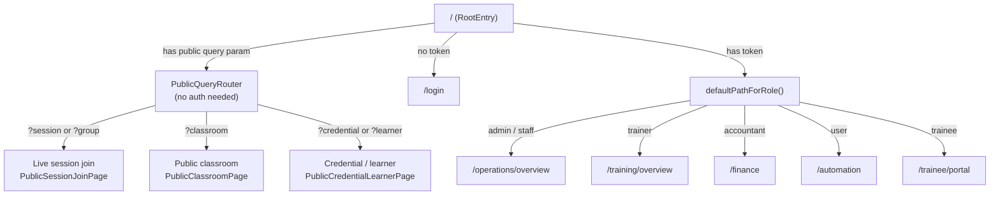

# SBS Staff Dashboard — Designer Handoff

**Audience:** UI/UX designers, product designers, and design agencies commissioned to redesign or extend the SBS internal dashboard.

**What this document covers:** every authenticated and public screen, who can see each screen, what data each screen reads and writes (via serverless API calls), the navigation structure, and brand/token pointers. It does **not** cover deployment, database schema, or migration procedures — see the linked docs at the bottom for those.

---

## 1. Hard constraints for any redesign

| # | Constraint | Source |
|---|-----------|--------|
| 1 | All user-facing text must be **English only**. No Arabic locale. | `CLAUDE.md` |
| 2 | The React SPA is served under **`/spa/`** (e.g. `https://host/spa/dashboard`). Client-side routes do not include `/spa` as a prefix in the router; the basename is stripped automatically. | `App.tsx` |
| 3 | The "backend" from the browser's perspective is a set of **Netlify serverless functions** at `/.netlify/functions/<name>`. The browser never talks to Supabase directly. | `api.ts` |
| 4 | Auth is **JWT stored in `localStorage`** (`sbs_token`). Any 401 response auto-clears the session and redirects to `/spa/login`. | `api.ts` |
| 5 | Brand colors, typography, and spacing tokens are defined in `dashboard-ui/src/styles/theme.css` and must be respected in any redesign. | `theme.css` |

---

## 2. Personas and area access

The table below maps each role to the top-level sidebar areas it is allowed to access. The last column shows the default landing route after login.

| Role | Sidebar areas visible | Default landing |
|------|-----------------------|-----------------|
| `admin` | Dashboard, Operations, Training, Finance, Email Campaigns, Admin | `/operations/overview` |
| `staff` | Dashboard, Operations, Email Campaigns | `/operations/overview` |
| `trainer` | Dashboard, Training | `/training/overview` |
| `accountant` | Dashboard, Finance | `/finance` |
| `user` | Dashboard, Email Campaigns | `/automation` |
| `trainee` | **No sidebar** — single portal page only | `/trainee/portal` |

**Trainee exception:** even though `ROLE_AREAS` lists `training` for trainees in the source, `canAccessPath` in `roleAccess.ts` overrides this and restricts trainees to only `/trainee/portal` and `/account/password`. They see no sidebar at all.

**Training sub-nav visibility:** Inside the Training section, the "Assignments" and "Assessments" tabs are shown only to `admin` and `trainer`. Other roles (e.g. `staff` if they somehow had training access) do not see those two tabs.

---

## 3. Information architecture

### 3.1 Global layout shell (authenticated, non-trainee)

```
┌─────────────────────────────────────────────────────────────┐
│  TopBar: page title · subtitle · [theme toggle] [WhatsApp?] [sign out]
├─────────┬───────────────────────────────────────────────────┤
│ Sidebar │  Main content area (scrollable)                   │
│         │                                                   │
│ • Dashboard            ┌─ Sub-navigation bar (area tabs) ─┐│
│ • Operations           │ shown inside Operations / Training││
│ • Training             └───────────────────────────────────┘│
│ • Finance              ┌─ Page component ──────────────────┐│
│ • Email Campaigns      │                                   ││
│ • Admin                │                                   ││
│                        └───────────────────────────────────┘│
└─────────┴───────────────────────────────────────────────────┘
```

The sidebar is hidden on mobile; a hamburger button opens it as an overlay sheet.

### 3.2 Operations sub-navigation (tab bar, always visible inside `/operations`)

Overview · Trainees · Courses · Batches · Enrollments · Import · Insights · LMS admin · Integration events

### 3.3 Training sub-navigation (two groups, always visible inside `/training`)

**Delivery and classroom:** Overview · Sessions · Presenter tools · Classroom · *(Assignments — admin/trainer only)* · *(Assessments — admin/trainer only)* · Attendance & Materials

**LMS and library:** LMS analytics · LMS catalog · Course Library · Credentials

### 3.4 Trainee layout shell

No sidebar. A sticky sub-navigation bar with hash anchors scrolls to sections within the single `/trainee/portal` page. Sections: My Courses, Classroom & Materials, Assignments, Change Password.

### 3.5 Public (unauthenticated) shell

No sidebar, no auth. A minimal brand shell (`PublicShell`) wraps one of three public surfaces depending on the URL query key present.

---

## 4. Complete screen inventory

Paths below are **router-internal** (without the `/spa` URL prefix). Full browser URL: `https://<host>/spa<path>`.

### Authentication and account

| Path | Screen label | Roles | React page | Primary API calls |
|------|-------------|-------|------------|-------------------|
| `/login` | Login | All (unauthenticated) | `LoginPage.tsx` | POST `login` (staff/admin) · POST `trainee-login` (trainee) |
| `/account/password` | Change password | All authenticated | `ChangePasswordPage.tsx` | POST `change-password` |

### Home dashboard

| Path | Screen label | Roles | React page | Primary API calls |
|------|-------------|-------|------------|-------------------|
| `/dashboard` | Dashboard | All except trainee | `DashboardPage.tsx` | GET `operations-data?resource=operations-overview` · GET `finance-data?resource=kpis` · GET `training-sessions` · GET `classroom-data?resource=pending-submissions` |

The home dashboard shows role-dependent tiles: admins see the full set (ops KPIs, finance KPIs, active sessions, pending submission queue); trainers see sessions + pending submissions; accountants see finance KPIs only; staff/user see ops overview.

### Operations area (`/operations/*`)

| Path | Screen label | Roles | React page | Primary API calls |
|------|-------------|-------|------------|-------------------|
| `/operations/overview` | Operations — Overview | admin, staff | `OperationsOverviewPage.tsx` | GET `operations-data?resource=operations-overview` |
| `/operations/trainees` | Operations — Trainees | admin, staff | `OperationsPage.tsx` (tab) | GET/POST/PUT/DELETE `operations-data?entity=trainees` · GET `operations-data?resource=trainer-course-access` (for trainer assignment) |
| `/operations/courses` | Operations — Courses | admin, staff | `OperationsPage.tsx` (tab) | GET/POST/PUT/DELETE `operations-data?entity=courses` |
| `/operations/batches` | Operations — Batches | admin, staff | `OperationsPage.tsx` (tab) | GET/POST/PUT/DELETE `operations-data?entity=batches` |
| `/operations/enrollments` | Operations — Enrollments | admin, staff | `OperationsPage.tsx` (tab) | GET/POST/PUT/DELETE `operations-data?entity=enrollments` |
| `/operations/import` | Operations — Import | admin, staff | `OperationsImportPage.tsx` | POST `operations-data?entity=...&bulk=1` (Excel upload) |
| `/operations/insights` | Operations — Insights | admin, staff | `OperationsInsightsPage.tsx` | GET `operations-data?resource=pipeline` · GET `operations-data?resource=capacity` · GET `operations-data?resource=data-quality` |
| `/operations/lms-admin` | Operations — LMS admin | admin, staff | `OperationsLmsAdminPage.tsx` | GET/POST `lms-admin-data?resource=programs\|cohorts\|cohort-enrollments\|rubric-templates\|rubric-criteria\|certificates\|transcripts` |
| `/operations/integration-events` | Operations — Integration events | admin, staff | `OperationsIntegrationEventsPage.tsx` | GET `integration-events` · PATCH `integration-events` |
| `/operations/trainees/:traineeId` | Trainee profile | admin, staff | `TraineeProfilePage.tsx` | GET `operations-data?entity=trainees&id=...&include=enrollments` · PUT `operations-data?entity=trainees` (save notes) |

**Operations CRUD pattern:** All four entity tabs (Trainees, Courses, Batches, Enrollments) use the same `OperationsPage` component with a tab switcher. Each row has Edit and Delete actions opening a shared `OperationEntityModal`. The Import tab accepts `.xlsx` files and bulk-upserts via the same `operations-data` function with `bulk=1`.

### Training area (`/training/*`)

| Path | Screen label | Roles | React page | Primary API calls |
|------|-------------|-------|------------|-------------------|
| `/training/overview` | Training — Overview | admin, trainer | `TrainingOverviewPage.tsx` | GET `training-sessions` |
| `/training/sessions` | Training — Sessions | admin, trainer | `TrainingSessionsPage.tsx` | GET/DELETE `training-sessions` · POST `training-sessions` (create via `TrainingSessionCreateModal`) |
| `/training/presenter` | Training — Presenter tools | admin, trainer | `TrainingPresenterPage.tsx` | GET `training-sessions` (session picker) |
| `/training/classroom` | Training — Classroom | admin, trainer | `TrainingClassroomPage.tsx` | GET `classroom-data?resource=classrooms` · GET `classroom-data?resource=share-link` · GET/POST/DELETE `classroom-data?resource=materials` (via `BatchMaterialManager`) · POST `classroom-material-upload` (file upload) |
| `/training/assignments` | Training — Assignments | admin, trainer | `TrainingAssignmentsPage.tsx` | GET `classroom-data?resource=classrooms\|assignments\|assignment-files\|submissions` · POST/PATCH/DELETE `classroom-data?resource=assignments\|assignment-files\|submissions` · POST `classroom-assignment-upload` |
| `/training/assessments` | Training — Assessments | admin, trainer | `TrainingAssessmentsPage.tsx` | GET `assessment-data?resource=assessments\|questions\|attempts` · POST `assessment-data?resource=assessments\|questions` · PATCH `assessment-data?resource=progress` |
| `/training/materials` | Training — Attendance & Materials | admin, trainer | `TrainingMaterialsAttendancePage.tsx` | GET `training-sessions` · GET/POST/DELETE `training-data?resource=materials` · GET/POST/DELETE `training-data?resource=attendance` |
| `/training/library` | Training — Course Library | admin, trainer | `TrainingCourseLibraryPage.tsx` | GET `course-library-data?resource=courses` · GET `course-library-data?resource=library&course_id=...` |
| `/training/credentials` | Training — Credentials | admin, trainer | `TrainingCredentialsPage.tsx` | GET `credential-center?resource=credentials` |
| `/training/lms-analytics` | Training — LMS analytics | admin, trainer | `TrainingLmsAnalyticsPage.tsx` | GET `lms-analytics?resource=overview` · GET `lms-analytics?resource=completion-by-course` |
| `/training/lms-catalog` | Training — LMS catalog | admin, trainer | `TrainingLmsCatalogPage.tsx` | GET `lms-admin-data?resource=programs\|cohorts\|cohort-enrollments\|rubric-templates\|rubric-criteria\|certificates\|transcripts` (**read-only**) |

**Presenter tools** is a three-tab utility panel (no backend mutations): QR code generator (URL → PNG, runs in browser via `qrcode` library), Script reader (text-to-speech), and Teleprompter. The only API call is fetching the session list for the session picker.

**Assignments vs LMS admin:** `TrainingAssignmentsPage` manages per-batch staff assignments and trainee submissions. `OperationsLmsAdminPage` manages formal LMS objects (programs, cohorts, rubrics, certificates). They are separate surfaces.

### Finance area

| Path | Screen label | Roles | React page | Primary API calls |
|------|-------------|-------|------------|-------------------|
| `/finance` | Finance | admin, accountant | `FinancePage.tsx` | GET `finance-data?resource=kpis` · GET `finance-data?resource=chart-revenue-trend&months=6` · GET `finance-data?resource=invoices` · GET `finance-data?resource=ledger&page=1&pageSize=25` · POST `finance-data?resource=payment` · POST `finance-data?resource=invoices` |

Finance renders chart visualisations using **Recharts** (already a dependency). KPIs and the revenue trend chart are loaded on mount. The ledger and invoices list are tabbed within the same page. Record Payment and Create Invoice are modal forms.

### Email Campaigns

| Path | Screen label | Roles | React page | Primary API calls |
|------|-------------|-------|------------|-------------------|
| `/automation` | Email Campaigns | admin, staff, user | `CampaignsPage.tsx` | **n8n webhook** (not a Netlify function): POST `{action: preview\|send\|stop\|status}` directly to the user-configured n8n webhook URL |

**Important for designers:** The campaigns page is unusual — it calls an **external n8n webhook URL** that is stored in `localStorage` (`sbs_sendmails_webhook`), not a Netlify function. The sheet URL for recipient data is also in `localStorage` (`sbs_sendmails_sheet_url`). The page has three sub-sections: (1) Webhook/sheet URL configuration, (2) Email composer with template picker, merge token insertion, and rich-text body, (3) Send / stop / status controls.

### Admin area

| Path | Screen label | Roles | React page | Primary API calls |
|------|-------------|-------|------------|-------------------|
| `/admin` | Admin | admin | `AdminPage.tsx` | GET `list-users` · POST `create-user` · POST `delete-user` · POST `reset-password` · POST `trainee-admin-reset` · GET `demo-support-config` · GET `finance-data?resource=audit` |

The admin page contains three sections: User management (list + create + delete + reset password), a trainee password reset tool, and a Finance audit log viewer (admin-only).

### Trainee portal

| Path | Screen label | Roles | React page | Primary API calls |
|------|-------------|-------|------------|-------------------|
| `/trainee/portal` | Trainee portal | trainee | `TraineePortalPage.tsx` | GET `trainee-me` · GET `trainee-courses` · GET `trainee-classroom?batch_id=...` · POST `trainee-submissions` · POST `trainee-submission-upload` · POST `trainee-change-password` |

The portal is a **single long-scroll page** with a sticky sub-nav. Sections:
1. **My courses** — enrollment cards with status and payment info.
2. **Classroom & Materials** — batch-level materials list (the trainee selects a batch first).
3. **Assignments** — per-batch assignment cards; trainees can type a text answer and attach files.
4. **Change password** — simple form, calls `trainee-change-password`.

---

## 5. Public (unauthenticated) surfaces

These pages are triggered when the root URL (`/`) has specific query parameters. No login is required.

| Query key(s) | Surface | React page | Primary API calls |
|--------------|---------|------------|-------------------|
| `?session=<id>` or `?group=<token>` | Live session / group join | `PublicSessionJoinPage.tsx` | GET `public-training-session` · POST `training-join` · GET/POST `training-messages` · GET `public-config` (Supabase Realtime credentials) |
| `?classroom=<token>` | Public classroom | `PublicClassroomPage.tsx` | GET `public-classroom` · POST `public-classroom-submit` · POST `public-classroom-review` |
| `?credential=<token>` or `?learner=<slug>` | Credential / learner profile | `PublicCredentialLearnerPage.tsx` | GET `credential-public?resource=verify` · GET `credential-public?resource=learner-profile` |

### Live session room (public join flow)

The live session join page is the most complex public surface:

- **Layout:** SBS-branded strip (logo + "Joined as …") at the top, then an embedded **Jitsi** voice room, then an in-page realtime panel (Chat, Whiteboard, Polls).
- **Realtime:** Chat, whiteboard drawing, and polls sync via **Supabase Realtime broadcast** on channel `public-live-{group_uuid}`. Whiteboard strokes are not persisted to the database (ephemeral only).
- **Voice:** Embedded Jitsi (External API) using audio-first mode with a minimal toolbar (mic + hang up). The Jitsi server is configurable via `JITSI_MEET_BASE`; defaults to the public `meet.jit.si`.
- **Session ended detection:** The page polls `public-training-session` to detect when a trainer closes the session.
- **Polls:** Trainer-initiated; ephemeral (broadcast only, not stored).

---

## 6. Designer-relevant runtime behaviors

These runtime behaviors should inform copy, empty states, and loading/error patterns.

- **Auth and 401:** On any API 401 the user is silently logged out and redirected to `/spa/login`. Design should account for this "session expired" path — no explicit error modal is shown.
- **Role-based content on shared pages:** The home dashboard (`/dashboard`) renders different tile sets per role at runtime. The same React component branches on `sbs_role` in `localStorage`.
- **Trainer-only tabs in Training:** Assignments and Assessments tabs appear in the Training sub-nav only for `admin` and `trainer`. The page component also gates write actions (create/delete/patch) on `canWriteAssessment()` which checks the same role.
- **Email Campaigns — external webhook:** The n8n webhook URL is entered by the user and saved in `localStorage`. If it is not configured, send/preview/status will fail. The UI should handle the unconfigured state gracefully.
- **Realtime (live sessions):** If Supabase Realtime is disabled (`public-config` returns `realtimeEnabled: false`), the page falls back to polling for chat messages. Whiteboard and polls are silently disabled.
- **File uploads (assignments, materials):** Uploads are a two-step flow — (1) POST to a Netlify function to get a signed upload URL, (2) PUT the file directly to that URL. The UI should reflect both steps.
- **Theme:** Light mode is supported via CSS. The theme toggle is in the TopBar. Design tokens in `theme.css` define both dark (`:root`) and light (`html.light`) variants.

---

## 7. Brand tokens and visual identity

### Color palette (CSS variables in `theme.css`)

| Token | Value | Use |
|-------|-------|-----|
| `--brand-bg` | `#0e1035` | Page background (dark theme) |
| `--brand-surface` | `#161a4f` | Card / sidebar surface |
| `--brand-surface-2` | `#1e245e` | Hover states, secondary surfaces |
| `--brand-navy` | `#1b1464` | Deep navy accent |
| `--brand-indigo` | `#2e3192` | Indigo accent |
| `--brand-border` | `#3438a0` | Borders |
| `--brand-text` | `#f4f3fb` | Primary text (light on dark) |
| `--brand-muted` | `#b4b0c8` | Secondary / muted text |
| `--brand-primary` | `#00a99d` | Primary action (teal) |
| `--brand-primary-2` | `#29abe2` | Secondary action (blue) |
| `--brand-primary-deep` | `#0071bc` | Deep blue variant |
| `--brand-accent` | `#f7931e` | Accent / highlight (orange) |
| `--brand-accent-2` | `#f59e3b` | Warm amber accent |
| `--brand-danger` | `#ed1c24` | Error / destructive |
| `--brand-success` | `#39b54a` | Success / positive |

Light mode overrides the background and surface tokens to lighter equivalents. The primary and accent colors remain the same.

### Typography

| Font | Use |
|------|-----|
| **Inter** (UI) | All body text, labels, tables, forms |
| **Montserrat** (brand) | Headings and marketing-style display text (`.font-brand` class) |

Type scale: `xs` 0.75rem → `sm` 0.875rem → `base` 1rem → `lg` 1.125rem → `xl` 1.25rem → `2xl` 1.5rem → `3xl` 1.875rem → `4xl` 2.25rem.

### Spacing and radius

Spacing scale: 4 / 8 / 12 / 16 / 20 / 24 / 28 / 32 px (tokens `--sp-1` through `--sp-8`).

Border radius: `--brand-radius` 12 px (cards, modals) · `--brand-radius-dense` 8 px (compact elements).

### Logo

`dashboard/assets/logo.png` — white-text mark for dark backgrounds. Referenced in the SPA as `/assets/logo.png`.

For full brand assets (PDF color palette, alternate logo formats): [`brand/README.md`](../brand/README.md) and [`brand/palette.json`](../brand/palette.json).

---

## 8. Navigation flow diagram



---

## 9. Data and entities reference

For entity columns, relationships, and workbook-driven field names used in Operations CRUD forms, see:

- [`docs/DATA_MODEL.md`](DATA_MODEL.md) — workbook entities: trainees, courses, batches, enrollments and their field names.
- [`docs/sample-import/README.md`](sample-import/README.md) — required columns for Excel bulk import (`.xlsx` template).

---

## 10. Related documentation

| Document | Why read it |
|----------|------------|
| [`docs/FULL_INFO.md`](FULL_INFO.md) | Technical twin to this doc: stack details, deployment notes, full serverless function inventory |
| [`docs/DASHBOARD.md`](DASHBOARD.md) | Narrative module descriptions and additional API resource parameter details |
| [`docs/LMS_UX_AUDIT_AND_DESIGN_SYSTEM.md`](LMS_UX_AUDIT_AND_DESIGN_SYSTEM.md) | Existing UX audit against SaaS benchmarks; current pain points and design system gaps |
| [`docs/DATA_MODEL.md`](DATA_MODEL.md) | Workbook entity schema and field definitions |
| [`docs/deploy/NETLIFY_SUPABASE.md`](deploy/NETLIFY_SUPABASE.md) | Deployment and environment variable context |
| [`brand/README.md`](../brand/README.md) | Official brand asset inventory |
| [`brand/palette.json`](../brand/palette.json) | Machine-readable color palette |
| [`dashboard-ui/src/styles/theme.css`](../dashboard-ui/src/styles/theme.css) | Complete CSS token definitions (dark + light mode) |

---

## 11. Maintenance note

When new routes or API calls are added to the SPA, update the screen inventory table in this file in the same PR. Also update [`dashboard-ui/src/lib/routeMeta.ts`](../dashboard-ui/src/lib/routeMeta.ts) (TopBar titles) and the relevant layout file (`OperationsLayout.tsx` or `TrainingLayout.tsx`) if new sub-nav tabs are added.
