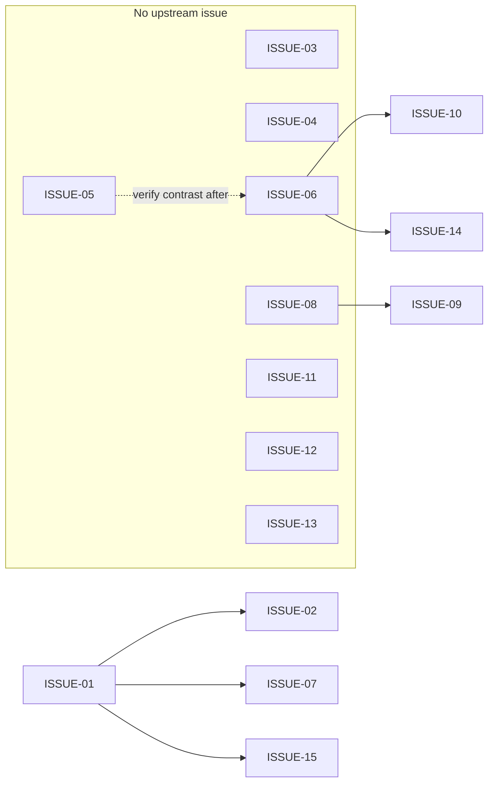

# SBS LMS / Training Platform — UI/UX Audit & Design System

**Scope:** React SPA served at `https://lms-sbs.vercel.app/spa` (Vite app under `dashboard-ui/`, router basename `/spa`).  
**Evidence:** Code review of `dashboard-ui/src` plus public entry (unauthenticated shell shows login).  
**Goal:** Raise perceived quality toward modern SaaS benchmarks (Notion, Stripe Dashboard, Linear) while respecting SBS brand constraints.

---

## Section 1 — Product understanding

### 1.1 Product type

This is a **hybrid internal platform**: operations and automation for staff **plus** training delivery and a **trainee-facing learning surface** (assignments, materials, course library chapters, password lifecycle). It is **not** a consumer MOOC; it is closer to **B2B training operations + cohort LMS**.

### 1.2 User roles (as implemented)

| Role | Primary intent | Main surfaces |
|------|----------------|---------------|
| **Trainee** | Consume learning, submit work, manage password | `/trainee/portal` only (enforced by `AreaGuard` + `defaultPathForRole`) |
| **Trainer** | Run batches, classroom links, assignments, assessments, materials | `/training/*` |
| **Staff** | Operations, email campaigns (role-dependent) | `/operations/*`, `/automation`, etc. |
| **Admin** | Full areas including training, finance, admin | Multiple `/training/*`, `/admin`, `/operations/lms-admin` |
| **Accountant** | Finance KPIs and flows | `/finance` |
| **User** (default) | Narrow automation access | `/automation` |

Source: `dashboard-ui/src/lib/roleAccess.ts`, `App.tsx`, `TraineePortalPage.tsx`.

### 1.3 Core journeys (map to routes / modules)

| Journey | Who | Current implementation notes |
|---------|-----|------------------------------|
| **Sign-in & role routing** | All | `LoginPage.tsx` → `localStorage` role → `defaultPathForRole` |
| **Course browsing (trainee)** | Trainee | `TraineePortalPage`: “My courses” list → selects `batch_id` |
| **Enrollment visibility** | Trainee | Enrollment status, payment status, amount shown per course card |
| **Lesson / resource consumption** | Trainee | `ResourceList`, chapter `<details>`, links open in new tab |
| **Assignments** | Trainee | `AssignmentCard`: textarea + raw file input + save |
| **Progress tracking** | Trainee | Implicit via enrollment strings; **no** progress bar / completion UX at portal level |
| **Instructor / staff course & batch ops** | Trainer, Admin | `TrainingClassroomPage`, `TrainingSessionsPage`, `TrainingAssignmentsPage`, materials |
| **LMS catalog (read-only)** | Staff with training | `TrainingLmsCatalogPage` — tabbed GET views; edits directed to Operations → LMS admin |

---

## Section 2 — Full UI/UX audit

Each issue uses the requested format.

### 2.1 Visual hierarchy

| Severity | Location | Problem | Why it hurts | Solution | SaaS example |
|----------|----------|---------|--------------|----------|----------------|
| **Medium** | `ProtectedLayout` + `TopBar.tsx` | `TopBar` is almost never given `title` / `subtitle` from routes; default shows only “Signed in as …”. | Users lose **where they are** in a deep app (Training has 10+ sub-routes). Linear always shows **workspace + page context** in the header. | Introduce a small **route metadata** map (or React context) so each page registers **title, section, optional breadcrumb**. Pass into `TopBar`. | Linear header + breadcrumb; Stripe’s page title left-aligned in chrome. |
| **Medium** | `LoginPage.tsx` | Hero title is **“SBS Staff Dashboard”** for both staff and trainee account types. | Trainees feel the product is “not for them”; trust and clarity drop. | Switch H1/subcopy by `accountType`: e.g. “Sign in to SBS” + role-specific subtitle; keep one brand. | Notion’s login is neutral; role-specific copy post-auth. |
| **Low** | `TrainingLayout.tsx` | Page `h1` is always “Training” regardless of sub-area. | Subtle disorientation when deep-linking to e.g. LMS catalog. | Keep H1 as area; add **dynamic page label** from child route or outlet context. | Stripe: product area stable, **page title** changes. |

### 2.2 Layout & spacing consistency

| Severity | Location | Problem | Why it hurts | Solution | SaaS example |
|----------|----------|---------|--------------|----------|----------------|
| **Critical** | `App.tsx` `ProtectedLayout` | Fixed `ml-64` + fixed sidebar `w-64` with **no collapse / drawer** for narrow viewports. | On tablets and phones the layout **overlaps or overflows**; unusable for field staff or trainees on mobile. | Add **responsive sidebar**: `md:` breakpoint drawer + hamburger in `TopBar`; trainee layout already full-width — ensure **touch targets** and padding. | Notion mobile sidebar; Stripe responsive nav. |
| **Medium** | `TraineePortalPage.tsx` | Dense grids (`md:grid-cols-4` metadata) without card grouping hierarchy. | Important “must change password” competes visually with profile trivia. | Use **visual priority**: banner component for security state; compress metadata into **definition list** or “Account” sub-card. | Stripe “Action required” banners. |
| **Low** | `theme.css` | Spacing tokens stop at `--sp-8` (32px); no 40/48/64 scale. | Large sections feel either **too tight** or authors use arbitrary `p-6` everywhere. | Extend tokens: 40, 48, 64; document **section rhythm** (e.g. 24 between blocks, 48 between sections). | Linear’s generous section spacing. |

### 2.3 Typography system

| Severity | Location | Problem | Why it hurts | Solution | SaaS example |
|----------|----------|---------|--------------|----------|----------------|
| **Medium** | `theme.css` | Single family **Montserrat** for everything; `h1` in login uses `text-4xl` utility while base theme sets `h1` to `--font-size-3xl`. | **Two sources of truth** for headings; Montserrat at small sizes is less readable than Inter for dense tables. | Keep brand font for **marketing/display**; use **Inter or system UI** for **data-dense** surfaces OR tune Montserrat weights/sizes. Align **one** heading scale via components. | Stripe: clean sans for UI; Notion: UI + editorial separation. |
| **Low** | `TrainingLmsCatalogPage.tsx` | Table cells `font-mono text-xs` for all values. | Legitimate for IDs; **hostile** for human-readable titles. | Column-type aware typography: mono for UUIDs, **sans** for names; truncation with **tooltip**. | Stripe table typography by column type. |

### 2.4 Color system & contrast

| Severity | Location | Problem | Why it hurts | Solution | SaaS example |
|----------|----------|---------|--------------|----------|----------------|
| **Medium** | `theme.css` (comment: palette from brand) | Dark navy UI with teal primary; **no documented contrast pairs** for WCAG on all interactive combos. | Risk of **AA failures** on muted text on `surface-2`, or borders vs background. | Run **automated contrast audit** on: `muted on surface`, `primary on white` (if used), focus rings. Add **--brand-focus-ring** token. | Stripe’s token docs include contrast notes. |
| **Low** | Status colors | Success/danger exist but **no “warning”** semantic (amber) for “due soon” assignments. | Trainers miss **at-risk** signals without a third state. | Add `--brand-warning` and `Badge` variants; use in assignment due dates. | Linear priority + due soon cues. |

### 2.5 Navigation & information architecture

| Severity | Location | Problem | Why it hurts | Solution | SaaS example |
|----------|----------|---------|--------------|----------|----------------|
| **Medium** | Trainee vs staff | Trainee has **no left nav**; staff has **7+ top-level areas** in `Sidebar.tsx`. | Trainees rely on **one long scroll**; staff cognitive load is high without **grouping** (e.g. “Workspaces”). | Trainee: add **minimal left rail** — Home, Courses, Assignments, Account **or** sticky sub-nav per course context. | Notion sidebar simplicity for guests/members. |
| **Medium** | `TrainingLayout.tsx` | Horizontal pill list mixes **operational** tools (Presenter, Classroom) with **LMS data** (LMS catalog, analytics). | IA feels **flat**; new trainers do not know sequencing. | Group tabs with **section labels** or split into **two rows**: “Delivery” vs “Catalog & credentials”. | Stripe: **Organize** nav groups. |
| **Low** | `Sidebar.tsx` | “Dashboard” links to `/` which redirects by role — label may not match destination. | Mild mental model mismatch. | Rename to **“Home”** or show destination in tooltip for trainees if ever exposed. | — |

### 2.6 Component consistency

| Severity | Location | Problem | Why it hurts | Solution | SaaS example |
|----------|----------|---------|--------------|----------|----------------|
| **Medium** | `TrainingLmsCatalogPage.tsx` vs `TrainingLayout.tsx` | Tabs: raw `<button>` styling vs `NavLink` pills — **similar but not identical** (border on inactive differs). | UI feels **hand-rolled** per page. | Extract **`SegmentedControl` / `Tabs`** primitive (you already have shadcn `tabs.tsx` — align usage policy). | Stripe unified tabs. |
| **Medium** | `AssignmentCard` in `TraineePortalPage.tsx` | Native `<input type="file">` **not** using design-system patterns. | Looks unfinished vs `Input` / `Button`. | Wrap file control: **custom button** + hidden input + file name chip (accessible). | Linear attachment UX. |
| **Low** | `Card` vs shadcn | Both `design-system/Card` and `components/ui/card.tsx` exist. | Drift risk over time. | **Policy:** feature pages use **one**; deprecate the other or alias exports. | — |

### 2.7 UX flows

| Severity | Location | Problem | Why it hurts | Solution | SaaS example |
|----------|----------|---------|--------------|----------|----------------|
| **Medium** | Assignment submission | Save does not show **optimistic success** separation from errors; `passwordMsg` success uses muted color. | Users unsure if state persisted. | Toast (`sonner` already in project) + clear **success** color; inline “Saved” with timestamp optional. | Notion “Saved” pattern. |
| **Low** | Course switching | Clicking another course swaps classroom data without **transition**. | Feels jumpy. | Skeleton for classroom card on `activeBatchId` change; preserve scroll position where possible. | — |

### 2.8 Empty states / loading / errors

| Severity | Location | Problem | Why it hurts | Solution | SaaS example |
|----------|----------|---------|--------------|----------|----------------|
| **Medium** | Many pages | Loading = plain text “Loading…” (`TraineePortalPage`, `TrainingClassroomPage`). | Perceived performance worse than reality; looks **non-production**. | Use **`Skeleton`** from `components/ui/skeleton.tsx` in **page templates**. | Stripe shimmer skeletons. |
| **Medium** | `TrainingLmsCatalogPage.tsx` | Empty copy: “No rows.” / “Enter an ID above and load.” | Functional but **cold**; no next action. | Add **EmptyState** component: title, one-line help, **primary CTA** (“Go to LMS admin”, “Copy cohort ID help”). | Linear empty issues view. |
| **Low** | Errors | Red bordered box is consistent — good. | Lacks **error code / support hint** for admins. | Optional “Copy debug info” for staff roles. | Stripe error surfaces. |

### 2.9 Accessibility (basic)

| Severity | Location | Problem | Why it hurts | Solution | SaaS example |
|----------|----------|---------|--------------|----------|----------------|
| **Medium** | `LoginPage.tsx` | Logo `alt=""` (decorative assumption) but logo is **brand-identifying**. | SR users lose context. | Meaningful `alt` text e.g. “SBS logo”. | — |
| **Medium** | `TraineePortalPage` `<details>` chapters | Default `<summary>` styling may have **insufficient focus visibility** depending on browser. | Keyboard users unclear where focus is. | Style `summary` with `focus-visible:ring` using brand focus token. | Gov.uk / Stripe focus rings. |
| **Low** | Tables | Truncation without **title attribute** or tooltip for full cell value. | Screen magnifier users cannot read full ID. | Add `title={full}` or `Tooltip` on hover/focus. | — |

### 2.10 Mobile responsiveness

| Severity | Location | Problem | Why it hurts | Solution | SaaS example |
|----------|----------|---------|--------------|----------|----------------|
| **Critical** | `Sidebar` + `ProtectedLayout` | No responsive pattern (see 2.2). | **Blocks mobile adoption** entirely. | Priority fix: collapsible nav + stack `TopBar` actions into menu. | Stripe mobile. |
| **Medium** | Tables (`TrainingClassroomPage`, catalog) | Wide tables in `Card noPadding` will **scroll horizontally** without clear affordance. | Users do not know content continues off-screen. | **Sticky first column** or card-based **row expansion** on small screens. | Responsive data cards pattern (Stripe billing mobile). |

---

## Section 3 — Design system (full)

> **Brand constraint:** `theme.css` states official SBS colors must not be changed arbitrarily. The system below **extends** tokens (neutrals, semantic, spacing) and **documents usage** without replacing brand primaries.

### 3.1 Color system

**Brand (existing — keep)**

| Token | Hex | Usage |
|-------|-----|--------|
| `--brand-bg` | `#0e1035` | App canvas |
| `--brand-surface` | `#161a4f` | Cards, sidebar |
| `--brand-surface-2` | `#1e245e` | Elevated / hover surfaces |
| `--brand-border` | `#3438a0` | Borders, dividers |
| `--brand-text` | `#f4f3fb` | Primary text |
| `--brand-muted` | `#b4b0c8` | Secondary text |
| `--brand-primary` | `#00a99d` | Primary actions |
| `--brand-primary-2` | `#29abe2` | Info / links accent |
| `--brand-primary-deep` | `#0071bc` | Primary pressed / deep |
| `--brand-accent` | `#f7931e` | Marketing highlights |
| `--brand-danger` | `#ed1c24` | Destructive / error |
| `--brand-success` | `#39b54a` | Success |

**Extended neutrals (semantic scale for charts, table zebra, subtle panels)** — add as new CSS variables (do not replace brand surfaces for main chrome):

| Scale | Suggested hex (on dark UI) | Usage |
|-------|---------------------------|--------|
| N-900 | `#070818` | Deepest inset panels |
| N-800 | `#0e1035` | Alias to bg |
| N-700 | `#12143a` | Table header bg |
| N-600 | `#161a4f` | Alias surface |
| N-500 | `#1e245e` | Alias surface-2 |
| N-400 | `#2a2f72` | Hover row |
| N-300 | `#3438a0` | Alias border |
| N-200 | `#5c61b8` | Disabled borders |
| N-100 | `#8b8fc9` | Placeholder-strong |
| N-50 | `#b4b0c8` | Alias muted |

**Semantic extensions**

| Role | Token | Hex suggestion |
|------|--------|------------------|
| Warning | `--brand-warning` | `#f5a524` |
| Info | `--brand-info` | use `--brand-primary-2` |
| Focus ring | `--brand-focus` | `rgba(41, 171, 226, 0.45)` |

### 3.2 Typography

**Pairing (recommendation)**

- **UI / tables / forms:** `Inter, system-ui, sans-serif`
- **Marketing / hero / print-style headings:** keep **Montserrat** for brand moments only

**Scale (single source — use components, not ad-hoc utilities)**

| Style | Size | Line height | Weight |
|-------|------|-------------|--------|
| Display | 36px (2.25rem) | 1.15 | 700 |
| H1 | 30px (1.875rem) | 1.2 | 700 |
| H2 | 24px (1.5rem) | 1.25 | 600 |
| H3 | 20px (1.25rem) | 1.3 | 600 |
| H4 | 18px (1.125rem) | 1.35 | 600 |
| Body | 16px (1rem) | 1.6 | 400–500 |
| Small | 14px (0.875rem) | 1.5 | 400–500 |
| Caption | 12px (0.75rem) | 1.45 | 500, muted color |

**Data / monospace**

- Use `font-mono` **only** for IDs, tokens, JSON — never for human titles.

### 3.3 Spacing system

Base unit **4px**.

| Token | px | Typical use |
|-------|-----|-------------|
| 1 | 4 | Tight icon gaps |
| 2 | 8 | Inline compact padding |
| 3 | 12 | Form field vertical rhythm |
| 4 | 16 | Card padding mobile |
| 5 | 20 | — |
| 6 | 24 | Card padding desktop default |
| 8 | 32 | Section gap |
| 10 | 40 | **NEW** — section padding |
| 12 | 48 | **NEW** — page section separation |
| 16 | 64 | **NEW** — hero / major sections |

### 3.4 Grid & breakpoints

| Breakpoint | Min width | Layout behavior |
|------------|-------------|-----------------|
| `sm` | 640px | Stack → two columns for forms |
| `md` | 768px | **Sidebar collapses to icon or drawer** |
| `lg` | 1024px | Trainee portal 3-column grid as today |
| `xl` | 1280px | Max content width for readability |
| `2xl` | 1536px | Optional max container `max-w-[1440px] mx-auto` for ultra-wide |

**Container:** inner content `max-w-7xl` (1280px) with `px-4 md:px-6` for main.

### 3.5 Radius & shadows (align to existing + polish)

| Token | Value | Use |
|-------|-------|-----|
| `--radius-sm` | 8px | Inputs, chips |
| `--radius-md` | 12px | Cards (default) |
| `--radius-lg` | 16px | Modals, feature cards |
| `--shadow-soft` | existing | Resting cards |
| `--shadow-strong` | existing | Hover / popovers |

### 3.6 Component guidelines

#### Buttons (`design-system/Button.tsx`)

| Variant | Usage | Hover | Active | Disabled |
|---------|-------|-------|--------|----------|
| Primary | Single primary CTA per view | Darken to `primary-deep` | `scale-[0.98]` | `opacity-50`, `cursor-not-allowed` |
| Secondary | Secondary actions | `surface-2` → `indigo` | slight scale | same |
| Danger | Delete / irreversible | darker red | scale | same |
| Ghost | Tertiary in dense toolbars | `surface-2` bg | — | same |
| Accent | Promotions only | `accent-2` | — | same |

**Rules:** Max **one** primary per card section; destructive right-aligned in footers.

#### Inputs (`design-system/Input.tsx`)

- Always pair `label` + `id` (generate with `useId` if needed).
- **Error** state: border + `aria-invalid` + message id for `aria-describedby`.
- **Help** under field, muted.

#### Cards (`design-system/Card.tsx`)

- Default: `surface`, soft shadow, `p-6`.
- `elevated`: login / marketing hero.
- `noPadding`: tables — add **padding on header row** only for breathing room.

#### Tables

- Header: `N-700` background, **uppercase caption** 11px tracking-wide OR semibold 12px (pick one globally).
- Zebra: optional `N-800` / transparent alternating **only** for 10+ rows.
- Row height min **48px** for touch.

#### Modals / sheets

- Prefer **Sheet** on mobile for filters; **Dialog** on desktop for confirmations.
- Focus trap + `Esc` to close; return focus to trigger.

#### Sidebar (`layout/Sidebar.tsx`)

- Active: primary bg + white text (current) — good; add **collapsed** state with **icons only** + tooltips at `md`.

#### Navbar / TopBar

- Left: **page title stack** (title + optional subtitle + breadcrumb).
- Right: support (optional), **user menu** (future), Sign out grouped.

---

## Section 4 — UI architecture

### 4.1 Component hierarchy (target)

```
App
├── BrowserRouter (/spa)
├── Routes
│   ├── LoginPage (full-bleed marketing layout)
│   └── ProtectedLayout
│       ├── AppShell
│       │   ├── Sidebar (role-aware, collapsible)
│       │   └── Column
│       │       ├── TopBar (breadcrumb + title from Route handle)
│       │       └── PageScaffold
│       │           ├── PageHeader (title, description, actions)
│       │           ├── PageToolbar (filters — optional)
│       │           └── PageBody
│       │               └── {children}
│       └── AreaGuard
```

### 4.2 Reusability strategy

1. **Page scaffold** — one component enforcing spacing, max width, and skeleton slot.
2. **DataTable** primitive — column defs with `kind: 'id' | 'text' | 'money' | 'date'` drives typography and truncation.
3. **EmptyState** + **ErrorState** + **LoadingState** — three composables used on every fetch-heavy page.
4. **Trainee-specific** — `TraineeShell` variant of `AppShell` with **course context header** (course name, batch, status pills).

### 4.3 Folder structure (React — incremental migration)

```
dashboard-ui/src/
  app/
    layouts/
      AppShell.tsx
      TraineeShell.tsx
      PageScaffold.tsx
    pages/          # route components (thin)
    features/
      trainee-portal/
        components/
        hooks/
      training-classroom/
      lms-catalog/
    components/
      design-system/  # presentational primitives
      ui/               # shadcn — policy: pick one table/tabs source
  lib/
    routeMeta.ts      # path → title, section, breadcrumb
  styles/
    theme.css
```

**Rule:** Route files **compose** features; **no** 400-line pages — split `TraineePortalPage` into `features/trainee-portal/*`.

---

## Section 5 — UX improvement plan (prioritized)

### Phase 1 — Critical fixes (Week 1–2)

1. **Responsive shell:** collapsible `Sidebar`, `TopBar` overflow menu, fix `ml-64` for small screens.
2. **Login copy:** role-aware hero; fix logo `alt` text.
3. **Route titles in TopBar** via route metadata — immediate wayfinding win.

### Phase 2 — Structure & consistency (Week 3–5)

1. Unify **tab / segmented** controls (`TrainingLayout`, `TrainingLmsCatalogPage`, other tabbed pages).
2. **Skeleton loading** on `TraineePortalPage`, `TrainingClassroomPage`, dashboard widgets.
3. **File upload** UX in assignments (design-system aligned).
4. **Table responsiveness** strategy (sticky col or card rows).

### Phase 3 — Visual polish (Week 6–8)

1. Typography split (Inter for data, Montserrat for brand surfaces) — verify contrast after.
2. **Empty states** with CTAs across training + operations.
3. **Warning** semantic color + badges for due dates.
4. Polish `details/summary` chapter UI (icons, counts, smooth expand).

### Phase 4 — Advanced UX (Week 9+)

1. **Trainee progress model** — completion %, last visited, continue CTA (needs product + API).
2. **Command palette** (⌘K) for staff navigation — Linear pattern.
3. **Notification center** for assignment feedback / announcements.
4. Performance: route-based code splitting, lazy charts.

---

## Section 6 — Frontend implementation guide

### 6.1 React + Tailwind

- Prefer **`@theme inline`** tokens from `theme.css` over raw hex in new code.
- Use **`cn()`** helper (from `components/ui/utils.ts`) for conditional classes.
- Avoid mixing **`h1` both in CSS `@layer base` and utility `text-4xl`** — pick **component-level** `PageTitle`.

### 6.2 Naming

- Components: **PascalCase** `AssignmentCard.tsx`
- Hooks: **`useTraineeClassroom.ts`**
- Event handlers: **`handleSubmit`**, not `onClick` inline for complex logic
- API types: colocate `types.ts` per feature or `lib/api/types/*`

### 6.3 Component patterns

- **Container/presenter:** fetch in hook `useTraineePortalData`, UI in dumb components.
- **Forms:** consider **React Hook Form** + zod for assignment + password flows (validation UX).

### 6.4 State management

- **Server state:** TanStack Query (recommended) — replaces scattered `useEffect` + manual loading flags; gives caching, retries, stale-while-revalidate.
- **UI state:** React context or Zustand **only** for sidebar open, theme, command palette.

### 6.5 Example — improved page header (sketch)

```tsx
// layouts/PageScaffold.tsx (conceptual)
export function PageScaffold({
  title,
  description,
  actions,
  children,
}: {
  title: string;
  description?: string;
  actions?: React.ReactNode;
  children: React.ReactNode;
}) {
  return (
    <div className="mx-auto max-w-7xl space-y-6 px-1 sm:px-0">
      <header className="flex flex-col gap-3 sm:flex-row sm:items-start sm:justify-between">
        <div>
          <h1 className="text-2xl font-bold text-[var(--brand-text)]">{title}</h1>
          {description ? (
            <p className="mt-1 max-w-2xl text-sm text-[var(--brand-muted)]">{description}</p>
          ) : null}
        </div>
        {actions ? <div className="flex shrink-0 flex-wrap gap-2">{actions}</div> : null}
      </header>
      {children}
    </div>
  );
}
```

Wire `title` / `description` from `routeMeta` or each page for `TopBar` sync.

---

## Section 7 — Continuous improvement loop

| Step | Owner | Artifact |
|------|-------|-----------|
| 1. **Evaluate** | Design + Eng | Quarterly **heuristic review** (Nielsen 10) on top 5 flows; screenshot diff vs baseline in `.mcp-playwright-output/` |
| 2. **Detect** | Eng | **Lighthouse CI** (performance, a11y, SEO) on `/spa/login` + authenticated smoke (staging creds); track regressions |
| 3. **Improve** | Product | Prioritized backlog from Section 5; each PR must state **which issue ID** resolved |
| 4. **Re-test** | QA / Eng | Manual **role matrix** (trainee, trainer, admin) checklist after each release |
| 5. **Measure** | Product | Optional PostHog / Plausible for **time-to-submit assignment**, **error rate** on login |

**Exit criteria for “top SaaS quality” (pragmatic)**

- Mobile sidebar usable.
- WCAG **AA** on primary flows (automated + spot check).
- **< 3s** perceived load on trainee portal (skeleton + fast API or cached query).
- **0** critical IA issues in moderated test with 3 trainers + 3 trainees.

---

## Appendix — File index (audit traceability)

| Area | Key files |
|------|-----------|
| Routing / shell | `dashboard-ui/src/app/App.tsx`, `ProtectedLayout` |
| Trainee LMS | `dashboard-ui/src/app/pages/TraineePortalPage.tsx` |
| Training IA | `dashboard-ui/src/app/pages/training/TrainingLayout.tsx` |
| Staff training tools | `TrainingClassroomPage.tsx`, `TrainingLmsCatalogPage.tsx`, … |
| Theme | `dashboard-ui/src/styles/theme.css` |
| Layout chrome | `components/layout/Sidebar.tsx`, `TopBar.tsx` |
| Auth / roles | `lib/roleAccess.ts`, `components/AreaGuard.tsx` |
| Primitives | `components/design-system/*`, `components/ui/*` |

---

## Section 8 — Issue → implementation mapping (execution engine)

> **Repository root for all paths:** `dashboard-ui/`. **Router basename:** `/spa` (paths below are React Router paths *inside* the basename).  
> **Purpose:** PR-ready mapping only — design rationale lives in Sections 2–3.

### 8.0 Master registry (Critical + Medium)

| ID | Sev | PR group | Primary files | Routes | Lines ~ | Blocked by |
|----|-----|----------|---------------|--------|---------|------------|
| ISSUE-01 | Critical | PR-1 Shell | `src/app/App.tsx`, `src/app/components/layout/Sidebar.tsx`, `src/app/components/layout/TopBar.tsx` | all `ProtectedLayout` | 120–220 | — |
| ISSUE-02 | Medium | PR-2 Chrome | `App.tsx`, `TopBar.tsx`, `src/lib/routeMeta.ts` | `*` authed | 80–150 | ISSUE-01 |
| ISSUE-03 | Medium | PR-2 Chrome | `src/app/pages/LoginPage.tsx` | `/login` | 25–45 | — |
| ISSUE-04 | Medium | PR-3 Trainee | `src/app/pages/TraineePortalPage.tsx`, maybe `design-system/Alert.tsx` | `/trainee/portal` | 60–120 | — |
| ISSUE-05 | Medium | PR-7 Polish | `src/styles/theme.css`, `LoginPage.tsx` (+ grep fixes) | `*` | 40–120 | — |
| ISSUE-06 | Medium | PR-7 Polish | `theme.css`, `design-system/Input.tsx`, optional `docs/LMS_ACCESSIBILITY_TOKENS.md` | `*` | 30–80 | — |
| ISSUE-07 | Medium | PR-3 Trainee | `App.tsx`, `TraineePortalPage.tsx`, `layout/TraineeSubNav.tsx` | `/trainee/portal` | 70–130 | ISSUE-01 |
| ISSUE-08 | Medium | PR-4 Training IA | `pages/training/TrainingLayout.tsx` | `/training/*` | 35–55 | — |
| ISSUE-09 | Medium | PR-4 Training IA | `TrainingLayout.tsx`, `TrainingLmsCatalogPage.tsx`, `design-system/SegmentedNav.tsx` | `/training/*`, `/training/lms-catalog` | 120–200 | ISSUE-08 |
| ISSUE-10 | Medium | PR-3 Trainee | `TraineePortalPage.tsx` (`AssignmentCard`) | `/trainee/portal` | 45–90 | ISSUE-06 (focus) |
| ISSUE-11 | Medium | PR-3 Trainee | `src/main.tsx`, `TraineePortalPage.tsx` | `/trainee/portal` | 20–40 | — |
| ISSUE-12 | Medium | PR-5 Loading | `TraineePortalPage.tsx`, `TrainingClassroomPage.tsx` | `/trainee/portal`, `/training/classroom` | 50–100 | — |
| ISSUE-13 | Medium | PR-6 Catalog | `TrainingLmsCatalogPage.tsx`, `design-system/EmptyState.tsx` | `/training/lms-catalog` | 70–130 | — |
| ISSUE-14 | Medium | PR-7 Polish | `TraineePortalPage.tsx`, `theme.css` | `/trainee/portal` | 15–30 | ISSUE-06 |
| ISSUE-15 | Medium | PR-6 Catalog | `TrainingClassroomPage.tsx`, `TrainingLmsCatalogPage.tsx` | `/training/classroom`, `/training/lms-catalog` | 80–160 | ISSUE-01 |

---

### ISSUE-01 — Responsive app shell

| Field | Value |
|--------|--------|
| **Severity** | Critical |
| **Routes** | `/dashboard`, `/operations/*`, `/training/*`, `/finance`, `/automation`, `/admin`, `/account/password`, `/trainee/portal` |
| **Files (exact)** | `dashboard-ui/src/app/App.tsx` (`ProtectedLayout` ~L49–68), `dashboard-ui/src/app/components/layout/Sidebar.tsx`, `dashboard-ui/src/app/components/layout/TopBar.tsx` |
| **Components** | `ProtectedLayout`, `Sidebar`, `TopBar` |
| **Exact code changes** | 1) `App.tsx`: add `useState` for `mobileNavOpen`; import `Sheet`, `SheetContent`, `SheetTrigger` from `src/app/components/ui/sheet.tsx` (verify path). 2) `App.tsx`: change inner column from `ml-64` to `ml-0 md:ml-64` when `!isTrainee`; wrap `Sidebar` so **desktop** renders existing fixed aside for `md+`; **mobile** renders `<Sheet open={mobileNavOpen} onOpenChange={setMobileNavOpen}>` with `SheetContent side="left"` containing duplicate `<Sidebar />` **or** same Sidebar moved—pick one to avoid double nav lists in DOM (preferred: single Sidebar with responsive classes `hidden md:flex` + `md:hidden` sheet clone is acceptable short-term). 3) `TopBar.tsx`: add optional prop `onMenuClick?: () => void`; render `Button variant="ghost" size="sm"` with hamburger SVG, `className="md:hidden"`, only when `onMenuClick` defined. 4) `App.tsx`: pass `onMenuClick={() => setMobileNavOpen(true)}` when `!isTrainee`. 5) `main` column: append `min-w-0`. 6) On `useLocation` change, `setMobileNavOpen(false)`. |
| **New files** | Optional `src/app/layouts/AppShell.tsx` if extracting (≤200 lines). |
| **Dependencies** | None |
| **Expected UI result** | `<768px`: no body horizontal scroll; menu icon opens left panel with nav links; backdrop tap closes; `≥768px`: unchanged from today. |
| **PR breakdown** | **Modify:** `App.tsx` (~40–90 lines touched), `TopBar.tsx` (~25–40), `Sidebar.tsx` (~10–30 class changes). **Create:** 0–1 layout file. **Lines affected (approx):** 120–220. **Complexity:** L |

---

### ISSUE-02 — Route-aware TopBar

| Field | Value |
|--------|--------|
| **Severity** | Medium |
| **Routes** | All authenticated routes |
| **Files** | `dashboard-ui/src/lib/routeMeta.ts` (new), `dashboard-ui/src/app/App.tsx`, `dashboard-ui/src/app/components/layout/TopBar.tsx` |
| **Exact code changes** | 1) Create `getRouteMeta(pathname: string): { title: string; subtitle?: string }` with exhaustive keys for: `/`, `/dashboard`, `/trainee/portal`, `/account/password`, `/finance`, `/automation`, `/admin`, `/operations/overview`, `/operations/insights`, `/operations/import`, `/operations/integration-events`, `/operations/lms-admin`, `/operations/trainees/:id`, `/training/overview`, `/training/sessions`, `/training/presenter`, `/training/classroom`, `/training/assignments`, `/training/assessments`, `/training/materials`, `/training/library`, `/training/credentials`, `/training/lms-analytics`, `/training/lms-catalog`. Use prefix match for `/operations/trainees/`. 2) `ProtectedLayout`: `const loc = useLocation(); const meta = getRouteMeta(loc.pathname);` pass `title={meta.title} subtitle={meta.subtitle}`. 3) `TopBar.tsx`: render `<h2>{title}</h2>` when title; keep “Signed in as …” as `p` below subtitle or muted line **only if** space allows—never hide title when known. |
| **New files** | `src/lib/routeMeta.ts` |
| **Dependencies** | ISSUE-01 (hamburger row must not clip title) |
| **Expected UI result** | TopBar left always shows page title for known routes; unknown route shows “Dashboard” or safe fallback. |
| **PR breakdown** | **Modify:** `App.tsx` (~15–25), `TopBar.tsx` (~20–35). **Create:** `routeMeta.ts` (~80–120). **Lines ~:** 80–150. **Complexity:** M |

---

### ISSUE-03 — Login copy + logo `alt`

| Field | Value |
|--------|--------|
| **Routes** | `/login` |
| **Files** | `dashboard-ui/src/app/pages/LoginPage.tsx` (~L59–65 hero, ~L61 img) |
| **Exact code changes** | 1) Replace static H1 “SBS Staff Dashboard” with: `accountType === 'trainee' ? 'Sign in to SBS' : 'SBS Staff Dashboard'` (or unified “Sign in to SBS” for both + subtitle differs). 2) Subtitle: trainee = “Access your courses, assignments, and materials.” staff = “Internal operations platform for educational services.” 3) `` |
| **PR breakdown** | **Modify:** `LoginPage.tsx` only. **Lines ~:** 25–45. **Complexity:** S |

---

### ISSUE-04 — Trainee security + profile hierarchy

| Field | Value |
|--------|--------|
| **Routes** | `/trainee/portal` |
| **Files** | `dashboard-ui/src/app/pages/TraineePortalPage.tsx` (welcome card ~L246–258, grid ~L253–257) |
| **Exact code changes** | 1) When `me?.account?.must_change_password`, insert `<Alert variant="warning">` (or bordered callout) **above** first `Card`. 2) Replace `md:grid-cols-4` metadata block with `<dl className="grid …">` + `<dt>/<dd>` pairs. |
| **New files** | `design-system/Alert.tsx` if `components/ui/alert.tsx` unsuitable for brand colors. |
| **PR breakdown** | **Modify:** `TraineePortalPage.tsx` ~60–120 lines. **Create:** optional `Alert.tsx` ~40–70. **Complexity:** M |

---

### ISSUE-05 — Typography tokens

| Field | Value |
|--------|--------|
| **Files** | `dashboard-ui/src/styles/theme.css`, `LoginPage.tsx`, any file with `text-4xl` on headings (grep) |
| **Exact code changes** | 1) `:root { --font-ui: Inter, system-ui, sans-serif; }` + optional `@import` Inter (or system-only). 2) `body { font-family: var(--font-ui), var(--font-sans); }` **or** `body` keeps Montserrat but add `.font-ui` for tables—pick one documented in PR. 3) Align `LoginPage` H1 class to token scale (`text-3xl` matching theme h1). |
| **PR breakdown** | **Lines ~:** 40–120. **Complexity:** L |

---

### ISSUE-06 — Focus ring token + Input wiring

| Field | Value |
|--------|--------|
| **Files** | `theme.css`, `dashboard-ui/src/app/components/design-system/Input.tsx` |
| **Exact code changes** | 1) Add `--brand-focus-ring`. 2) In `Input.tsx`, replace `focus:ring-[var(--brand-primary)]/20` with `focus:ring-2 focus:ring-[var(--brand-focus-ring)]` (verify contrast). |
| **PR breakdown** | **Lines ~:** 30–80. **Complexity:** M |

---

### ISSUE-07 — Trainee sub-nav

| Field | Value |
|--------|--------|
| **Routes** | `/trainee/portal` |
| **Files** | `App.tsx`, `TraineePortalPage.tsx`, new `TraineeSubNav.tsx` |
| **Exact code changes** | 1) Add `id="trainee-courses"` etc. on section wrappers in `TraineePortalPage.tsx`. 2) `TraineeSubNav.tsx`: horizontal `nav` with `<a href="#...">` links + `scroll-mt-24` on targets. 3) `App.tsx`: between `TopBar` and `<main>`, `{isTrainee && <TraineeSubNav />}`. |
| **Dependencies** | ISSUE-01 |
| **PR breakdown** | **Lines ~:** 70–130. **Complexity:** M |

---

### ISSUE-08 — Training nav grouping

| Field | Value |
|--------|--------|
| **Files** | `dashboard-ui/src/app/pages/training/TrainingLayout.tsx` |
| **Exact code changes** | 1) Define `const deliveryLinks = [...]` and `const catalogLinks = [...]` from current `BASE_LINKS` + trainer splice logic. 2) Render two `<div>` blocks with label + `NavLink` row each. |
| **PR breakdown** | **Lines ~:** 35–55. **Complexity:** S |

---

### ISSUE-09 — SegmentedNav primitive

| Field | Value |
|--------|--------|
| **Files** | `design-system/SegmentedNav.tsx` (new), `TrainingLmsCatalogPage.tsx`, optionally `TrainingLayout.tsx` |
| **Exact code changes** | 1) Implement component with shared pill classes. 2) Catalog: replace `<button>` tab map with `<SegmentedNav variant="state" …>`. |
| **Dependencies** | ISSUE-08 |
| **PR breakdown** | **Lines ~:** 120–200. **Complexity:** M |

---

### ISSUE-10 — File picker pattern

| Field | Value |
|--------|--------|
| **Files** | `TraineePortalPage.tsx` inside `AssignmentCard` |
| **Exact code changes** | 1) `const inputRef = useRef<HTMLInputElement>(null)`. 2) `<input ref={inputRef} type="file" className="sr-only" aria-label="Upload file" />`. 3) `Button onClick={() => inputRef.current?.click()}`. 4) Show `file?.name` text + ghost clear. |
| **Dependencies** | ISSUE-06 |
| **PR breakdown** | **Lines ~:** 45–90. **Complexity:** M |

---

### ISSUE-11 — Sonner toasts

| Field | Value |
|--------|--------|
| **Files** | `dashboard-ui/src/main.tsx`, `TraineePortalPage.tsx` |
| **Exact code changes** | 1) `main.tsx`: `import { Toaster } from './app/components/ui/sonner'`; render `<><App /><Toaster /></>`. 2) After successful `saveSubmission` / password update: `toast.success('…')`. |
| **PR breakdown** | **Lines ~:** 20–40. **Complexity:** S |

---

### ISSUE-12 — Skeletons

| Field | Value |
|--------|--------|
| **Files** | `TraineePortalPage.tsx`, `TrainingClassroomPage.tsx` |
| **Exact code changes** | 1) Import `Skeleton` from `components/ui/skeleton.tsx`. 2) When `loading` / `classroomLoading` / `loading` table, return skeleton block matching layout (cards + table rows). |
| **PR breakdown** | **Lines ~:** 50–100. **Complexity:** M |

---

### ISSUE-13 — EmptyState in catalog

| Field | Value |
|--------|--------|
| **Files** | `TrainingLmsCatalogPage.tsx`, `design-system/EmptyState.tsx` |
| **Exact code changes** | 1) New `EmptyState` with props `title`, `description`, optional `action: { label, to }` using `Link` from `react-router-dom`. 2) Replace `No rows.` branches. |
| **PR breakdown** | **Lines ~:** 70–130. **Complexity:** M |

---

### ISSUE-14 — `details` focus ring

| Field | Value |
|--------|--------|
| **Files** | `TraineePortalPage.tsx` (`<summary>`), `theme.css` |
| **Exact code changes** | 1) Add class on `summary`: `focus-visible:outline-none focus-visible:ring-2 focus-visible:ring-[var(--brand-focus-ring)] rounded-[var(--brand-radius-dense)]`. |
| **Dependencies** | ISSUE-06 |
| **PR breakdown** | **Lines ~:** 15–30. **Complexity:** S |

---

### ISSUE-15 — Responsive tables

| Field | Value |
|--------|--------|
| **Files** | `TrainingClassroomPage.tsx`, `TrainingLmsCatalogPage.tsx` |
| **Exact code changes** | 1) Wrap `<Table>` in `<div className="w-full overflow-x-auto [-webkit-overflow-scrolling:touch]">`. 2) Below `md`, optionally render simplified card stack **or** add `min-w-[640px]` on table + fade hint—document choice in PR. |
| **Dependencies** | ISSUE-01 |
| **PR breakdown** | **Lines ~:** 80–160. **Complexity:** L |

---

## Section 9 — Step-by-step execution plan (no ambiguity)

### Phase 1 — Critical (must ship first)

#### ISSUE-01

| Step | Action |
|------|--------|
| 1 — Locate | Open `dashboard-ui/src/app/App.tsx`, find `function ProtectedLayout` and `className={`${isTrainee ? 'ml-0' : 'ml-64'}`. Open `Sidebar.tsx` fixed `w-64`. Open `TopBar.tsx` for props. |
| 2 — Refactor structure | Introduce mobile drawer state at `ProtectedLayout` level; split layout JSX into desktop sidebar vs mobile sheet content. |
| 3 — Apply design system | Use existing `Button`, `Sheet` from `components/ui/`; colors only via `var(--brand-*)` or Tailwind mapped tokens—no new raw hex. |
| 4 — Verify | 375 / 768 / 1280px: staff + trainee sign-in; no `document.documentElement.scrollWidth > clientWidth`; drawer closes on navigation; no console errors. |

#### ISSUE-03

| Step | Action |
|------|--------|
| 1 — Locate | `LoginPage.tsx` hero block and `<img` logo. |
| 2 — Refactor | Conditional strings by `accountType` state. |
| 3 — Apply design system | Keep existing `Card`, `Input`, `Button`; only text and `alt`. |
| 4 — Verify | Toggle staff/trainee; run axe on login; Lighthouse a11y spot-check. |

---

### Phase 2 — Structural fixes

#### ISSUE-02

| Step | Action |
|------|--------|
| 1 — Locate | `ProtectedLayout` in `App.tsx`, `TopBar` prop usage. |
| 2 — Refactor | Add `routeMeta.ts` pure function + default export or named `getRouteMeta`. |
| 3 — Apply design system | Title uses `text-lg font-semibold text-[var(--brand-text)]` (already in TopBar). |
| 4 — Verify | Click every `Sidebar` link + training tabs; title never blank for mapped routes. |

#### ISSUE-04, ISSUE-07, ISSUE-10, ISSUE-11, ISSUE-12

Execute in **PR-3 Trainee** (single PR acceptable if conflicts managed) using same 4-step pattern: Locate → Refactor structure → Apply tokens/components → Verify trainee-only flows.

#### ISSUE-08, ISSUE-09

Execute sequentially: **ISSUE-08** merge first, then **ISSUE-09** (SegmentedNav depends on stable IA).

#### ISSUE-13, ISSUE-15

**PR-6 Catalog:** EmptyState + table wrappers; 4-step verify on `/training/lms-catalog` and `/training/classroom`.

---

### Phase 3 — UI polish

#### ISSUE-05, ISSUE-06, ISSUE-14

Global tokens + Input focus + chapter `summary` focus; verify contrast and keyboard tab order on login + trainee portal.

---

## Section 10 — Definition of Done (strict)

A task **fails** review if **any** applicable box is unchecked.

### 10.1 Global mandatory

- [ ] **Tokens:** No new hardcoded hex in TSX/CSS except inside `theme.css` extension block approved in PR. Use `var(--brand-*)` or `@theme` tokens.
- [ ] **Responsive:** Verified at **375px**, **768px**, **1280px** on touched routes.
- [ ] **Loading:** Every **new or touched** async view in scope uses **`Skeleton`** (from `components/ui/skeleton.tsx`) for initial load—not bare “Loading…” text. *Exception:* document in PR if route has no async data.
- [ ] **Empty:** List/table views in scope use **`EmptyState`** (or existing equivalent) with CTA where product allows navigation.
- [ ] **Error:** User-visible errors use existing bordered alert pattern; network failures still surfaced.
- [ ] **A11y:** Labels on inputs; `focus-visible` on new controls; non-decorative images have meaningful `alt`.
- [ ] **Console:** `npm run build` (dashboard-ui) clean; zero new console errors on manual smoke.
- [ ] **Visual consistency:** New nav/tab controls share primitives (`SegmentedNav` / `Button`)—no one-off pill CSS in page files.

### 10.2 Applicability matrix (per issue)

| Issue | Skeleton required | EmptyState required | Table/overflow |
|-------|-------------------|---------------------|----------------|
| ISSUE-01 | N/A | N/A | N/A |
| ISSUE-02 | N/A | N/A | N/A |
| ISSUE-03 | N/A | N/A | N/A |
| ISSUE-04 | optional | N/A | N/A |
| ISSUE-05–06 | N/A | N/A | N/A |
| ISSUE-07 | N/A | N/A | N/A |
| ISSUE-08–09 | N/A | N/A | N/A |
| ISSUE-10–11 | N/A | N/A | N/A |
| ISSUE-12 | **Yes** | N/A | N/A |
| ISSUE-13 | N/A | **Yes** | overflow-x |
| ISSUE-14 | N/A | N/A | N/A |
| ISSUE-15 | optional | optional | **Yes** |

---

## Section 11 — AI execution prompts (code-first)

### Prompt A — Implement single issue

```text
Implement ISSUE-XX exactly as specified in docs/LMS_UX_AUDIT_AND_DESIGN_SYSTEM.md Section 8 (execution engine).

Output format (strict):
1) ```diff blocks per file``` OR full file contents for each changed file under path `dashboard-ui/...`
2) List of new files with full content
3) Commands run: cd dashboard-ui && npm run build (paste exit code)
Do not include prose explanation before the diffs. English UI strings only.
```

### Prompt B — Refactor full page

```text
Target file: dashboard-ui/src/app/pages/TraineePortalPage.tsx
Issue IDs: ISSUE-04, ISSUE-07, ISSUE-10, ISSUE-11, ISSUE-12

Output: complete new contents for TraineePortalPage.tsx plus any new files (Alert.tsx, TraineeSubNav.tsx). No summary paragraphs—only file contents and a single bullet list of props added.
Preserve all API endpoints and types from the original file.
```

### Prompt C — Validate UI consistency

```text
Run from repo root and paste outputs:
cd dashboard-ui
npx eslint "src/**/*.{ts,tsx}" --max-warnings 0
rg "Loading" src/app/pages/TraineePortalPage.tsx src/app/pages/training/TrainingClassroomPage.tsx
rg "text-\\[#" src/app/pages/training

Pass/Fail table with file:line for any violation. (On Windows use `npx rg` or Git Bash if `rg` not installed.)
```

### Prompt D — Compare before vs after

```text
For branch vs main on ISSUE-01 only:
git diff main -- dashboard-ui/src/app/App.tsx dashboard-ui/src/app/components/layout/TopBar.tsx dashboard-ui/src/app/components/layout/Sidebar.tsx

Paste diff. Then ASCII 375px wireframe: [Before: sidebar clipped] → [After: drawer].
```

---

## Section 12 — Machine-readable task system (JSON)

```json
[
  {"id":"ISSUE-01","title":"Responsive app shell","severity":"critical","pr_group":"PR-1-Shell","routes":["*"],"files":["dashboard-ui/src/app/App.tsx","dashboard-ui/src/app/components/layout/Sidebar.tsx","dashboard-ui/src/app/components/layout/TopBar.tsx"],"components":["ProtectedLayout","Sidebar","TopBar"],"actions":["state mobileNavOpen","md:ml-64 ml-0","Sheet mobile nav","TopBar hamburger","min-w-0 main","close on route"],"lines_approx":[120,220],"complexity":"L","dependencies":[]},
  {"id":"ISSUE-02","title":"Route-aware TopBar","severity":"medium","pr_group":"PR-2-Chrome","routes":["*"],"files":["dashboard-ui/src/lib/routeMeta.ts","dashboard-ui/src/app/App.tsx","dashboard-ui/src/app/components/layout/TopBar.tsx"],"components":["ProtectedLayout","TopBar"],"actions":["getRouteMeta map","useLocation pass meta"],"lines_approx":[80,150],"complexity":"M","dependencies":["ISSUE-01"]},
  {"id":"ISSUE-03","title":"Login copy and logo alt","severity":"medium","pr_group":"PR-2-Chrome","routes":["/login"],"files":["dashboard-ui/src/app/pages/LoginPage.tsx"],"components":["LoginPage"],"actions":["conditional H1 subtitle","alt on logo"],"lines_approx":[25,45],"complexity":"S","dependencies":[]},
  {"id":"ISSUE-04","title":"Trainee security banner profile dl","severity":"medium","pr_group":"PR-3-Trainee","routes":["/trainee/portal"],"files":["dashboard-ui/src/app/pages/TraineePortalPage.tsx"],"components":["TraineePortalPage"],"actions":["Alert must_change_password","dl metadata"],"lines_approx":[60,120],"complexity":"M","dependencies":[]},
  {"id":"ISSUE-05","title":"Typography tokens","severity":"medium","pr_group":"PR-7-Polish","routes":["*"],"files":["dashboard-ui/src/styles/theme.css","dashboard-ui/src/app/pages/LoginPage.tsx"],"components":["global"],"actions":["--font-ui","align login H1"],"lines_approx":[40,120],"complexity":"L","dependencies":[]},
  {"id":"ISSUE-06","title":"Focus ring token Input","severity":"medium","pr_group":"PR-7-Polish","routes":["*"],"files":["dashboard-ui/src/styles/theme.css","dashboard-ui/src/app/components/design-system/Input.tsx"],"components":["Input"],"actions":["--brand-focus-ring","focus ring classes"],"lines_approx":[30,80],"complexity":"M","dependencies":[]},
  {"id":"ISSUE-07","title":"Trainee sub nav anchors","severity":"medium","pr_group":"PR-3-Trainee","routes":["/trainee/portal"],"files":["dashboard-ui/src/app/App.tsx","dashboard-ui/src/app/pages/TraineePortalPage.tsx","dashboard-ui/src/app/components/layout/TraineeSubNav.tsx"],"components":["TraineeSubNav"],"actions":["section ids","scroll-mt","nav links"],"lines_approx":[70,130],"complexity":"M","dependencies":["ISSUE-01"]},
  {"id":"ISSUE-08","title":"Training nav grouped rows","severity":"medium","pr_group":"PR-4-Training-IA","routes":["/training/*"],"files":["dashboard-ui/src/app/pages/training/TrainingLayout.tsx"],"components":["TrainingLayout"],"actions":["split link arrays","labels"],"lines_approx":[35,55],"complexity":"S","dependencies":[]},
  {"id":"ISSUE-09","title":"SegmentedNav primitive","severity":"medium","pr_group":"PR-4-Training-IA","routes":["/training/lms-catalog","/training/*"],"files":["dashboard-ui/src/app/components/design-system/SegmentedNav.tsx","dashboard-ui/src/app/pages/training/TrainingLmsCatalogPage.tsx","dashboard-ui/src/app/pages/training/TrainingLayout.tsx"],"components":["SegmentedNav"],"actions":["router and state variants","replace catalog buttons"],"lines_approx":[120,200],"complexity":"M","dependencies":["ISSUE-08"]},
  {"id":"ISSUE-10","title":"Assignment file picker","severity":"medium","pr_group":"PR-3-Trainee","routes":["/trainee/portal"],"files":["dashboard-ui/src/app/pages/TraineePortalPage.tsx"],"components":["AssignmentCard"],"actions":["sr-only input","Button trigger","filename"],"lines_approx":[45,90],"complexity":"M","dependencies":["ISSUE-06"]},
  {"id":"ISSUE-11","title":"Sonner toaster","severity":"medium","pr_group":"PR-3-Trainee","routes":["/trainee/portal"],"files":["dashboard-ui/src/main.tsx","dashboard-ui/src/app/pages/TraineePortalPage.tsx"],"components":["root","TraineePortalPage"],"actions":["mount Toaster","toast.success"],"lines_approx":[20,40],"complexity":"S","dependencies":[]},
  {"id":"ISSUE-12","title":"Skeleton loading","severity":"medium","pr_group":"PR-5-Loading","routes":["/trainee/portal","/training/classroom"],"files":["dashboard-ui/src/app/pages/TraineePortalPage.tsx","dashboard-ui/src/app/pages/training/TrainingClassroomPage.tsx"],"components":["TraineePortalPage","TrainingClassroomPage"],"actions":["Skeleton layouts"],"lines_approx":[50,100],"complexity":"M","dependencies":[]},
  {"id":"ISSUE-13","title":"Catalog EmptyState","severity":"medium","pr_group":"PR-6-Catalog","routes":["/training/lms-catalog"],"files":["dashboard-ui/src/app/components/design-system/EmptyState.tsx","dashboard-ui/src/app/pages/training/TrainingLmsCatalogPage.tsx"],"components":["TrainingLmsCatalogPage"],"actions":["EmptyState component","replace no rows"],"lines_approx":[70,130],"complexity":"M","dependencies":[]},
  {"id":"ISSUE-14","title":"Details summary focus","severity":"medium","pr_group":"PR-7-Polish","routes":["/trainee/portal"],"files":["dashboard-ui/src/app/pages/TraineePortalPage.tsx","dashboard-ui/src/styles/theme.css"],"components":["TraineePortalPage"],"actions":["focus-visible ring on summary"],"lines_approx":[15,30],"complexity":"S","dependencies":["ISSUE-06"]},
  {"id":"ISSUE-15","title":"Responsive tables","severity":"medium","pr_group":"PR-6-Catalog","routes":["/training/classroom","/training/lms-catalog"],"files":["dashboard-ui/src/app/pages/training/TrainingClassroomPage.tsx","dashboard-ui/src/app/pages/training/TrainingLmsCatalogPage.tsx"],"components":["TrainingClassroomPage","TrainingLmsCatalogPage"],"actions":["overflow-x-auto wrapper","optional card fallback"],"lines_approx":[80,160],"complexity":"L","dependencies":["ISSUE-01"]}
]
```

---

## Section 13 — Execution strategy

### Strict order

1. **ISSUE-01** → 2. **ISSUE-02** + **ISSUE-03** (parallel) → 3. **ISSUE-08** → 4. **ISSUE-09** → 5. **PR-3 Trainee** batch (04,07,10,11,12—internal order: 11 before 10 optional) → 6. **PR-6** (13,15) → 7. **PR-7** (05,06,14).

### Parallel lanes

| Lane A | Lane B |
|--------|--------|
| ISSUE-03 | ISSUE-08 |
| ISSUE-12 | ISSUE-13 (after PR-4 if catalog tabs touched) |

### High-risk

- **`App.tsx` ProtectedLayout** — auth layout regression; test **trainee + staff + trainer + admin**.
- **`routeMeta.ts`** — wrong path strings cause blank titles; add unit test or snapshot of keys vs `App.tsx` routes.

### Suggested PR grouping

| PR | Issues | Rationale |
|----|--------|-----------|
| PR-1 | ISSUE-01 | Isolated layout risk |
| PR-2 | ISSUE-02, ISSUE-03 | Chrome + login; small files |
| PR-3 | ISSUE-04,07,10,11,12 | Trainee portal cohesive |
| PR-4 | ISSUE-08,09 | Training navigation |
| PR-5 | ISSUE-12 alone optional if split from PR-3 | Reduce PR size |
| PR-6 | ISSUE-13,15 | Data tables |
| PR-7 | ISSUE-05,06,14 | Global polish |

---

## Section 14 — PR templates

### 14.1 Title format

`[LMS-UX] <short outcome> (ISSUE-XX[, ISSUE-YY])`

### 14.2 Description template (copy into GitHub / Cursor)

```markdown
## Summary
- What changed: …
- Why: Closes ISSUE-XX (see docs/LMS_UX_AUDIT_AND_DESIGN_SYSTEM.md Section 8).

## Screenshots
| Before | After |
|--------|-------|
| (attach 375px if layout) | |

## Test plan
- [ ] 375 / 768 / 1280 responsive
- [ ] Keyboard tab through new controls
- [ ] No console errors on touched routes
- [ ] `cd dashboard-ui && npm run build` passes

## DoD (Section 10)
- [ ] Tokens / no stray hex
- [ ] Skeleton / Empty / Error per applicability matrix
- [ ] A11y spot-check

## Risk / rollout
- …
```

### 14.3 Example (filled)

**Title:** `[LMS-UX] Mobile sidebar drawer + shell (ISSUE-01)`

**Summary:** Implemented `mobileNavOpen` state in `ProtectedLayout`, `md:ml-64` / `ml-0` main column, Sheet-based mobile navigation, hamburger in `TopBar`, `min-w-0` on main. Closes ISSUE-01.

---

## Section 15 — Execution commands

> **Host:** paths below assume repo root `Sendmails SBS/`. SPA is served under **`/spa`** (Vite `base` / React `BrowserRouter` basename). Local dev: `http://localhost:5173/spa/...` (default Vite port; adjust if yours differs).

### 15.1 Install and build (required before every PR)

```powershell
cd dashboard-ui
npm install
npm run build
```

**Pass criteria:** `vite build` completes with exit code 0; no TypeScript errors in output.

### 15.2 Local dev (manual visual verification)

```powershell
cd dashboard-ui
npm run dev
```

Open browser at `http://localhost:5173/spa/login` then authenticate against your configured API (same as production).

### 15.3 Repo-level MCP / toolchain smoke (optional)

From repository root (parent of `dashboard-ui/`; includes MCP toolchain smoke):

```powershell
cd <path-to-sendmails-sbs-repo>
npm run mcp:verify
```

Use when validating MCP agents or CI machines—not a substitute for `npm run build` inside `dashboard-ui/`.

### 15.4 Issue → command matrix

| After closing… | Run |
|----------------|-----|
| **ISSUE-01, 02, 07, 15** | `npm run build` + responsive pass (Section 17 breakpoints) |
| **ISSUE-03** | `npm run build`; open `/spa/login` only (no auth) |
| **ISSUE-04–12 (trainee)** | `npm run build`; trainee login; `/spa/trainee/portal` |
| **ISSUE-08, 09, 13, 15 (training)** | `npm run build`; staff/trainer login; `/spa/training/*` |
| **ISSUE-05, 06, 14 (global)** | `npm run build` + keyboard focus pass on login + trainee portal |

### 15.5 Static search (regression guards)

Run from `dashboard-ui/` after trainee or table refactors:

```powershell
cd dashboard-ui
# Plain "Loading" text should be eliminated where ISSUE-12 applies (allow documented exceptions)
rg "Loading" src/app/pages/TraineePortalPage.tsx src/app/pages/training/TrainingClassroomPage.tsx
# Raw file input should be gone after ISSUE-10
rg 'type="file"' src/app/pages/TraineePortalPage.tsx
```

---

## Section 16 — Dependency graph

> **Rule:** An edge **A → B** means **complete A (or its PR) before starting B**. This matches Section 12 `dependencies` and Section 13 ordering.

### 16.1 Edge list (machine-readable)

| From | To | Reason |
|------|-----|--------|
| ISSUE-01 | ISSUE-02 | TopBar hamburger + title row layout depends on final shell |
| ISSUE-01 | ISSUE-07 | Trainee sub-nav sticky offset vs mobile drawer |
| ISSUE-01 | ISSUE-15 | Table overflow width assumes non-clipped main column |
| ISSUE-06 | ISSUE-10 | File picker buttons use shared focus token |
| ISSUE-06 | ISSUE-14 | `summary` focus ring uses `--brand-focus-ring` |
| ISSUE-08 | ISSUE-09 | SegmentedNav styling aligns to grouped IA |

**No hard dependency in JSON (can parallelize after PR-1):** ISSUE-03, ISSUE-04, ISSUE-05, ISSUE-06, ISSUE-08, ISSUE-11, ISSUE-12, ISSUE-13 — still coordinate with Section 13 for merge conflicts (e.g. ISSUE-12 touches same files as PR-3).

### 16.2 Diagram (Mermaid)



*Legend: `-.->` = soft recommendation (re-test contrast when typography lands), not a merge gate.*

### 16.3 PR merge order (same as Section 13, graph-aligned)

`PR-1 (01)` → `PR-2 (02,03)` → `PR-4 (08,09)` → `PR-3 (04,07,10,11,12)` with **06 before 10/14** if those ship same sprint → `PR-6 (13,15)` → `PR-7 (05,06,14)`.

---

## Section 17 — Visual verification

> **Baseline host:** production `https://lms-sbs.vercel.app/spa` **or** local `http://localhost:5173/spa`. Use **the same host** for before/after pairs.  
> **Viewports:** **375×812** (mobile), **768×1024** (tablet), **1280×800** (desktop)—match Section 10 responsive DoD.

### 17.1 Authenticated routes (relative to `/spa`)

| Route | Issues |
|-------|--------|
| `/login` | ISSUE-03 |
| `/trainee/portal` | ISSUE-04, 07, 10, 11, 12, 14 |
| `/dashboard` | ISSUE-01, 02 |
| `/training/overview` … `/training/credentials` | ISSUE-01, 02, 08, 09 |
| `/training/lms-catalog` | ISSUE-09, 13, 15 |
| `/training/classroom` | ISSUE-12, 15 |
| `/operations/overview` … `/operations/lms-admin` | ISSUE-01, 02, empty CTA links from ISSUE-13 |
| `/finance`, `/automation`, `/admin`, `/account/password` | ISSUE-01, 02 |

### 17.2 Per-issue capture checklist

| ID | What to capture | Pass |
|----|-----------------|------|
| **ISSUE-01** | Mobile: closed shell + open drawer + **no horizontal scrollbar** on `body`; desktop: sidebar flush | Drawer closes on route change; staff + trainee layouts |
| **ISSUE-02** | TopBar shows **title** on at least 3 distinct routes (e.g. training, operations, trainee) | Title non-empty; sign-out still visible |
| **ISSUE-03** | Staff vs trainee account type: hero + subtitle + logo inspect (accessibility tree) | Trainee does not see staff-only headline |
| **ISSUE-04** | `must_change_password` true (mock/staging): alert above welcome | Profile metadata readable in `dl` |
| **ISSUE-05** | Login + one dense table page: font change visible | No clipped headings |
| **ISSUE-06** | Tab through login form + one input page | Focus ring visible on every focusable |
| **ISSUE-07** | Sticky sub-nav visible; click each anchor | Sections scroll under TopBar correctly (`scroll-margin`) |
| **ISSUE-08** | Two labeled nav rows | All links still reachable for trainer vs admin |
| **ISSUE-09** | LMS catalog tabs + training pills (if migrated) | Active state + keyboard focus match |
| **ISSUE-10** | Assignment card: choose file + clear | Filename visible; no raw file widget |
| **ISSUE-11** | Save submission + password success | Toast appears once |
| **ISSUE-12** | Slow 3G throttle: initial load | Skeleton visible; no blank flash |
| **ISSUE-13** | Empty tab data | EmptyState + CTA visible |
| **ISSUE-14** | Tab to chapter `summary` | Focus ring visible |
| **ISSUE-15** | 375px: classroom + catalog tables | All row actions reachable (scroll or cards) |

### 17.3 Role matrix (minimum once per PR-1 / PR-3 / PR-4)

| Role | Routes to hit |
|------|----------------|
| **Trainee** | `/login` → `/trainee/portal` |
| **Trainer** | `/training/overview`, `/training/classroom`, `/training/lms-catalog` |
| **Staff** | `/operations/overview`, `/automation` (if role allows) |
| **Admin** | Above + `/admin`, `/operations/lms-admin` |

### 17.4 Evidence bundle (attach to PR)

- One **375px** screenshot per PR touching layout (ISSUE-01, 15) or trainee chrome (ISSUE-04, 07).  
- Optional: paste **Lighthouse** mobile a11y score for `/spa/login` when ISSUE-03 or ISSUE-06 lands.

---

*Document version: 3.1 — Sections 8–17: execution engine + commands + dependency graph + visual verification.*
